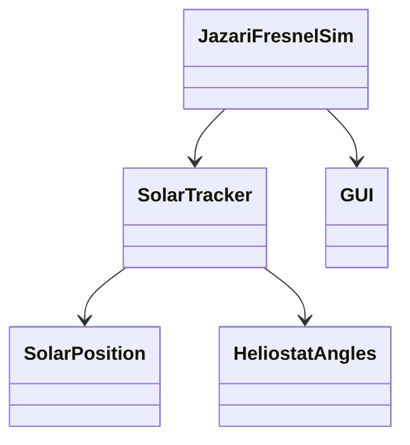

# Linear Fresnel Solar Simulator

[](https://opensource.org/licenses/MIT)
[](https://www.oracle.com/java/technologies/javase/jdk17-archive-downloads.html)
[](https://processing.org/)

A real-time 3D simulation system for Linear Fresnel Solar Collectors. This software provides accurate solar position calculations and mirror angle optimizations for any location, date, and time.

## 🌟 Features

- **Solar Position Calculation**
  - Real-time sun position tracking
  - Location-based calculations
  - Atmospheric refraction correction
  - Solar intensity estimation

- **Mirror Control System**
  - Automatic mirror angle optimization
  - Real-time angle adjustments
  - Multiple mirror support
  - Reflection visualization

- **Interactive 3D Visualization**
  - Real-time 3D rendering
  - Interactive camera controls
  - Sun path visualization
  - Ray tracing display

## 🔧 System Requirements

- Java 17 (recommended and tested version)
- Processing 3.3.7
- Minimum resolution: 1280x800
- OpenGL compatible graphics card
- Recommended CPU: Intel i5 or equivalent

### Platform Support
The simulator includes native libraries for:
- Windows (x64)
- Linux (x64, ARM)
- macOS (x64, ARM)

## 📋 Installation

1. **Clone the repository**
```bash
git clone https://github.com/your-username/JazariFresnelSim.git
cd JazariFresnelSim
```

2. **Open in NetBeans**
- Open NetBeans IDE
- File -> Open Project
- Navigate to the cloned directory
- Select the project and open

3. **Run the Simulation**
- Build and run the project in NetBeans
- The simulation will start with default parameters

## 🚀 Quick Start

```java
public class Example {
    public static void main(String[] args) {
        // Launch the simulation
        JazariFresnelSim.main(new String[0]);
    }
}
```

## 🏗 Architecture

The system uses a modular architecture separating solar calculations from visualization:



## 📖 Documentation

Detailed documentation includes:
- Setup and Installation Guide
- Solar Position Calculations
- Mirror Angle Optimization
- GUI Controls Reference
- API Documentation

## 🔬 Research Applications

This simulator can be used for:
- Solar Energy Research
- Heliostat Field Design
- Educational Purposes
- Performance Analysis
- Energy Optimization Studies

## 📚 Citation

If you use this project in your research, please cite:

```bibtex
@software{jazari_fresnel_sim_2024,
  author = {Ataş, İsa},
  title = {Linear Fresnel Solar Simulator},
  year = {2024},
  publisher = {GitHub},
  url = {https://github.com/your-username/JazariFresnelSim}
}
```

## 📄 License

This project is licensed under the MIT License - see the LICENSE file for details.

## 🙏 Acknowledgements

- Jazari Lab, Dicle University
- Processing Foundation
- All contributors and testers

## 📬 Contact

İsa Ataş - [isa_atas@dicle.edu.tr](mailto:isa_atas@dicle.edu.tr)

Project Link: [https://github.com/your-username/JazariFresnelSim](https://github.com/your-username/JazariFresnelSim)